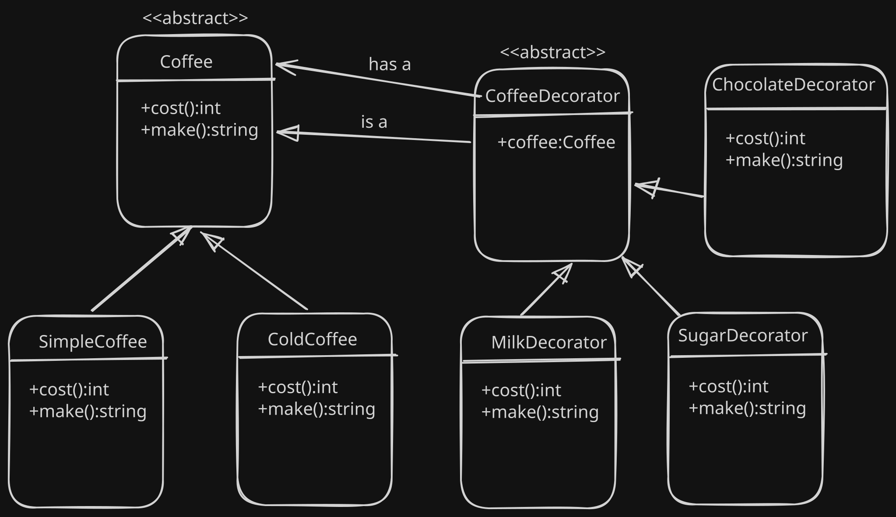

# ☕ Decorator Design Pattern (C++ Example)

A simple implementation of the **Decorator Design Pattern** using a coffee ordering system.  
It demonstrates how behavior can be dynamically extended without modifying existing classes.

---

## 🧠 Concept

The **Decorator Pattern** allows you to:
- Add responsibilities to objects **at runtime**
- Avoid class explosion caused by inheritance
- Combine behaviors flexibly using composition

---

## 🖼️ Diagram

---

## 🏗️ Structure

- **Component** → `Coffee` (interface)
- **Concrete Components** → `SimpleCoffee`, `ColdCoffee`
- **Decorator Base Class** → `CoffeeDecorator`
- **Concrete Decorators** →  
  - `MilkDecorator`  
  - `SugarDecorator`  
  - `ChocolateDecorator`

---

## ⚙️ How It Works

Each decorator:
- Wraps an existing `Coffee` object
- Adds its own cost
- Extends the preparation steps

🚀 Output
Make Simple Coffee add Milk add Sugar costs 140
Make Cold Coffee add Milk add Chocolate costs 205