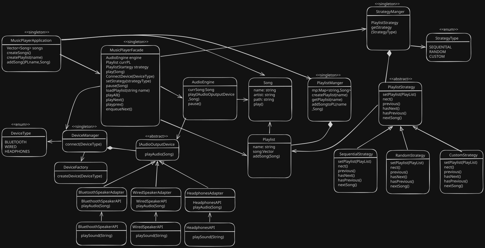

# Music Player Application

A low-level design (LLD) implementation of a feature-rich music player application demonstrating key software design patterns and principles in C++.

## Overview

This project is a sophisticated music player system that supports multiple playback strategies, various audio output devices, and playlist management. The architecture showcases several industry-standard design patterns to ensure maintainability, scalability, and loose coupling between components.

## Design Patterns Used

### 1. **Singleton Pattern** 🔐
Used for managing single instances of system-wide components:
- `MusicPlayerApplication` - Main entry point with global access
- `MusicPlayerFacade` - Simplified interface to complex subsystems
- `DeviceManager` - Manages audio output devices
- `PlaylistManager` - Manages playlists
- `StrategyManager` - Manages playback strategies
- `AudioEngine` - Core audio playback engine

**Benefit**: Ensures only one instance of critical components exists, preventing conflicts and resource wastage.

```cpp
static MusicPlayerApplication* getInstance() {
    if (!instance) {
        instance = new MusicPlayerApplication();
    }
    return instance;
}
```

### 2. **Facade Pattern** 🎭
`MusicPlayerFacade` provides a simplified unified interface to the complex subsystems:
- Abstracts complexity of AudioEngine, DeviceManager, PlaylistManager
- Provides single entry point for operations like play, pause, load playlists
- Decouples client code from internal implementation details

**Benefit**: Simplifies client interaction with a complex system through a unified interface.

### 3. **Strategy Pattern** 🎯
Multiple playback strategies that can be switched at runtime:
- `SequentialPlayStrategy` - Plays songs in order
- `RandomPlayStrategy` - Plays songs in random order
- `CustomQueueStrategy` - User-defined song order
- All implement the `PlayStrategy` interface

**Benefit**: Allows runtime selection of algorithms without changing client code.

```cpp
class PlayStrategy {
public:
    virtual ~PlayStrategy() {}
    virtual void setPlaylist(Playlist* playlist) = 0;
    virtual Song* next() = 0;
    virtual bool hasNext() = 0;
    virtual Song* previous() = 0;
    virtual bool hasPrevious() = 0;
    virtual void addToNext(Song* song) {}
};
```

### 4. **Adapter Pattern** 🔌
Device adapters translate external APIs to a common interface:
- `BluetoothSpeakerAdapter` - Adapts `BluetoothSpeakerAPI`
- `HeadphonesAdapter` - Adapts `HeadPhonesAPI`
- `WiredSpeakerAdapter` - Adapts `WiredSpeakerAPI`
- All implement `IAudioOutputDevice` interface

**Benefit**: Integrates external libraries with incompatible interfaces without modifying them.

```cpp
class IAudioOutputDevice {
public:
    virtual void playAudio(Song* song) = 0;
};
```

### 5. **Factory Pattern** 🏭
`DeviceFactory` creates appropriate device adapters based on device type:
- Encapsulates device creation logic
- Reduces coupling between client and concrete device classes
- Centralizes instantiation logic

**Benefit**: Simplifies object creation and makes the codebase more maintainable.

```cpp
class DeviceFactory {
public:
    static IAudioOutputDevice* createDevice(DeviceType deviceType) {
        if(deviceType == DeviceType::BLUETOOTH) {
            return new BluetoothSpeakerAdapter(new BluetoothSpeakerAPI());
        } else if(deviceType == DeviceType::HEADPHONES) {
            return new HeadphonesAdapter(new HeadPhonesAPI());
        } else {
            return new WiredSpeakerAdapter(new WiredSpeakerAPI());
        }
    }
};
```

### 6. **Manager Pattern** 📋
Specialized managers handle specific concerns:
- **DeviceManager** - Manages device connections and switching
- **PlaylistManager** - Manages playlist creation and songs
- **StrategyManager** - Manages playback strategies
- **AudioEngine** - Manages audio playback operations

**Benefit**: Separates concerns and provides organized access to different subsystems.

## System Architecture

### UML Diagram



The diagram illustrates:
- **Core Components**: AudioEngine, DeviceManager, PlaylistManager, StrategyManager
- **Models**: Song, Playlist, DeviceType, StrategyType enums
- **Strategies**: Sequential, Random, and Custom playback strategies
- **Device Adapters**: Bluetooth, Headphones, and Wired speaker integrations
- **Factory**: DeviceFactory for creating device adapters

## Project Structure

```
MusicPlayer/
├── core/
│   └── AudioEngine.hpp           # Core audio playback engine
├── device/
│   ├── IAudioOutputDevice.hpp    # Device interface
│   ├── BluetoothSpeakerAdapter.hpp
│   ├── HeadphonesAdapter.hpp
│   └── WiredSpeakerAdapter.hpp
├── enums/
│   ├── DeviceType.hpp            # Device type enumeration
│   └── StrategyType.hpp          # Playback strategy enumeration
├── external/
│   ├── BluetoothSpeakerAPI.hpp   # External Bluetooth API
│   ├── HeadPhonesAPI.hpp         # External Headphones API
│   └── WiredSpeakerAPI.hpp       # External Wired Speaker API
├── factories/
│   └── DeviceFactory.hpp         # Device creation factory
├── managers/
│   ├── DeviceManager.hpp         # Manages audio devices
│   ├── PlaylistManager.hpp       # Manages playlists
│   └── StrategyManager.hpp       # Manages playback strategies
├── models/
│   ├── Playlist.hpp              # Playlist model
│   └── Song.hpp                  # Song model
├── strategies/
│   ├── PlayStrategy.hpp          # Abstract strategy interface
│   ├── SequentialPlayStrategy.hpp
│   ├── RandomPlayStrategy.hpp
│   └── CustomQueueStartegy.hpp
├── MusicPlayerApplication.hpp    # Application entry point (Singleton)
├── MusicPlayerFacade.hpp         # Facade pattern implementation
├── main.cpp                      # Usage example
└── MusicPlayer.svg               # Architecture diagram
```

## Key Features

✅ **Multiple Playback Strategies**
- Sequential playback
- Random/shuffle playback
- Custom queue playback

✅ **Device Management**
- Support for Bluetooth speakers
- Headphones support
- Wired speakers support
- Dynamic device switching

✅ **Playlist Management**
- Create multiple playlists
- Add songs to playlists
- Load and manage playlists

✅ **Audio Control**
- Play individual songs
- Play entire playlists
- Pause functionality
- Previous/next track navigation
- Queue management

✅ **Clean Architecture**
- Minimal coupling between components
- High cohesion within modules
- Interface-based design

## Building the Project

### Prerequisites
- GCC/G++ compiler
- C++11 or later

### Compilation

Using the provided build task:
```bash
g++ -fdiagnostics-color=always -g main.cpp -o MusicPlayer.exe
```

Or compile directly:
```bash
cd e:\lld\LLD\MusicPlayer
g++ -std=c++11 main.cpp -o main.exe
```

## Usage Example

### Running the Application

```bash
./main.exe
```

### Sample Output

```
Bluetooth device connected

-- Playing Single Song --
🎵 Now playing: Zinda by Siddharth Mahadevan

-- Sequential Playback --
🎵 Now playing: Kesariya by Arijit Singh
🎵 Now playing: Chaiyya Chaiyya by Sukhwinder Singh
🎵 Now playing: Tum Hi Ho by Arijit Singh
🎵 Now playing: Jai Ho by A. R. Rahman

-- Random Playback --
🎵 Shuffling: Tum Hi Ho by Arijit Singh
🎵 Shuffling: Jai Ho by A. R. Rahman
🎵 Shuffling: Chaiyya Chaiyya by Sukhwinder Singh

-- Custom Queue Playback --
🎵 Queue: Kesariya by Arijit Singh
🎵 Queue: Tum Hi Ho by Arijit Singh

-- Navigation --
⏮️  Previous Track: Jai Ho by A. R. Rahman
⏮️  Previous Track: Chaiyya Chaiyya by Sukhwinder Singh
```

### Code Example

```cpp
// Create application instance
auto app = MusicPlayerApplication::getInstance();

// Add songs to library
app->createSongInLibrary("Kesariya", "Arijit Singh", "/music/kesariya.mp3");
app->createSongInLibrary("Chaiyya Chaiyya", "Sukhwinder Singh", "/music/chaiyya.mp3");

// Create playlist and add songs
app->createPlaylist("Bollywood Vibes");
app->addSongToPlaylist("Bollywood Vibes", "Kesariya");
app->addSongToPlaylist("Bollywood Vibes", "Chaiyya Chaiyya");

// Connect audio device
app->connectAudioDevice(DeviceType::BLUETOOTH);

// Play single song
app->playSingleSong("Kesariya");

// Set strategy and load playlist
app->selectPlayStrategy(StrategyType::SEQENTIAL);
app->loadPlaylist("Bollywood Vibes");
app->playAllTracksInPlaylist();

// Switch to random playback
app->selectPlayStrategy(StrategyType::RANDON);
app->playAllTracksInPlaylist();

// Custom queue
app->selectPlayStrategy(StrategyType::CUSTOM);
app->queueSongNext("Kesariya");
app->queueSongNext("Tum Hi Ho");
app->playAllTracksInPlaylist();
```

## Component Interactions

### Device Connection Flow
```
Client Code
    ↓
MusicPlayerFacade.connectDevice(DeviceType)
    ↓
DeviceManager.connect(DeviceType)
    ↓
DeviceFactory.createDevice(DeviceType)
    ↓
[BluetoothSpeakerAdapter | HeadphonesAdapter | WiredSpeakerAdapter]
    ↓
External API (BluetoothSpeakerAPI, etc.)
```

### Playback Flow
```
Client Code
    ↓
MusicPlayerFacade.playAllTracks()
    ↓
PlayStrategy.next() [SequentialPlayStrategy | RandomPlayStrategy | CustomQueueStrategy]
    ↓
AudioEngine.play(IAudioOutputDevice, Song)
    ↓
Device.playAudio(Song)
    ↓
External API
```

## Design Principles Applied

| Principle | Implementation |
|-----------|-----------------|
| **DRY** | Reusable manager classes and abstract interfaces |
| **SOLID** | Single Responsibility, Open/Closed, Liskov Substitution, Interface Segregation, Dependency Inversion |
| **Don't Repeat Yourself** | Factories and managers centralize logic |
| **Loose Coupling** | Dependency injection through interfaces |
| **High Cohesion** | Related functionality grouped in managers |

## Extension Points

The architecture supports easy extensions:

1. **Add New Playback Strategy**: Inherit from `PlayStrategy`
2. **Add New Device**: Create adapter and update `DeviceFactory`
3. **Enhance Audio Engine**: Extend `AudioEngine` with new features
4. **Add New Playlist Operations**: Extend `PlaylistManager`

## Learning Outcomes

This project demonstrates:
- ✅ Real-world application of design patterns
- ✅ Separation of concerns and modularity
- ✅ Dependency injection and inversion of control
- ✅ Abstract interfaces for flexibility
- ✅ Factory pattern for object creation
- ✅ Strategy pattern for algorithm selection
- ✅ Adapter pattern for third-party integration
- ✅ Singleton pattern for system-wide components

## Future Enhancements

- 🔮 Shuffle with history (don't repeat recently played songs)
- 🔮 Playlist persistence (save/load from files)
- 🔮 Equalizer controls
- 🔮 Volume control per device
- 🔮 Concurrent playback on multiple devices
- 🔮 Song recommendations based on history
- 🔮 UI/CLI interface

## License

Educational Project - Low-Level Design Study

---

**Created for**: Low-Level Design (LLD) Study and Practice  
**Language**: C++  
**Patterns**: Singleton, Facade, Strategy, Adapter, Factory, Manager  
**Focus**: Design Patterns and System Architecture
