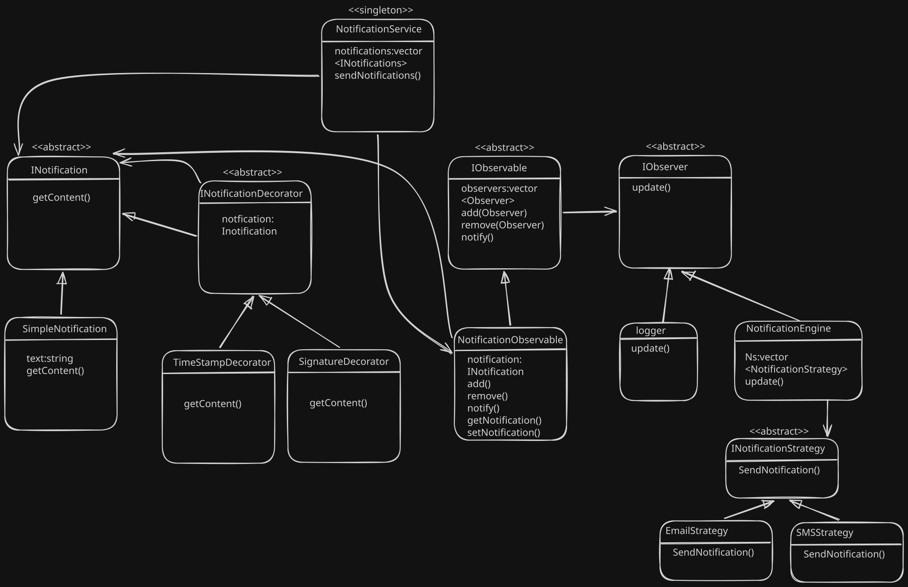

# 🔔 Notification System Design Patterns (C++)

A modular notification system built in **C++** demonstrating multiple important **Low-Level Design (LLD)** patterns working together in a real-world use case.

This project combines:

- ✅ Decorator Pattern
- ✅ Observer Pattern
- ✅ Strategy Pattern
- ✅ Singleton Pattern

The system supports dynamically enhanced notifications, multiple notification channels, and observer-based event updates.

---

## 🖼️ System Design Diagram



---

## 🚀 Features

- 🔔 Dynamic notification customization
- 👀 Observer-based event handling
- 📧 Multiple notification delivery strategies
- 🧩 Extensible and loosely coupled architecture
- 🏛 Singleton-based centralized notification service

---

## 🧠 Design Patterns Used

---

### 1. Decorator Pattern

Used to dynamically enhance notifications without modifying existing classes.

#### Decorators Added:
- `TimstampDecorator`
- `SignatureDecorator`

### Example

```cpp
INotification* notification =
new TimstampDecorator(
    new SignatureDecorator(
        new SimpleNotification("Order Delivered"),
        "tomato"
    )
);```

This allows runtime enhancement like:

Order Delivered tomato 12/12/2001
### 2. Observer Pattern

Used for notifying multiple subscribers whenever a new notification is sent.

Observers:
Logger
NotificationEngine
Observable:
NotificationObservable

When a notification is updated:

Logger logs it
Notification engine sends it through all channels
### 3. Strategy Pattern

Used to support multiple notification delivery mechanisms dynamically.

Strategies:
EmailNotification
SMSNotification

New delivery methods can be added easily without changing existing code.

### 4. Singleton Pattern

Used in NotificationService to ensure only one notification manager exists globally.

NotificationService* notificationService =
NotificationService::getInstance();

⚙️ Flow
- Create notification
- Decorate notification dynamically
- Send notification via NotificationService
- Observable notifies all observers
- Logger logs message
- NotificationEngine sends via strategies
### 🧪 Sample Output
Logging Order Delivered tomato 12/12/2001
sending email notification to abc@example.com: Order Delivered tomato 12/12/2001
sending sms notification to 3222-12-223: Order Delivered tomato 12/12/2001
### 📂 Main Components
Component	Responsibility
INotification	Base notification interface
INotificationDecorator	Base decorator
IObserver	Observer interface
IObservable	Observable interface
INotificationStrategy	Notification sending strategy
NotificationService	Singleton notification manager
💡 Key Learnings
Composition over inheritance
Loose coupling using interfaces
Runtime behavior extension
Event-driven architecture
Separation of concerns
🛠️ Compile & Run
g++ main.cpp -o app
./app
