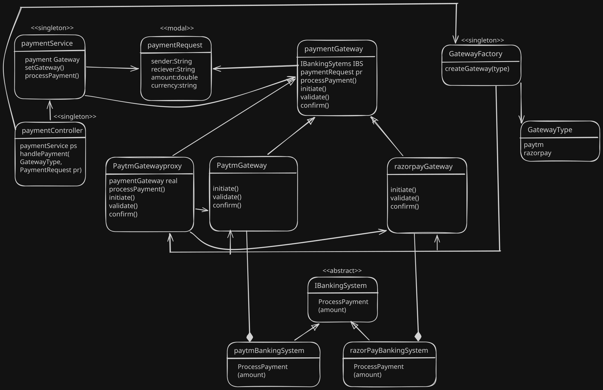

# 🔔 Payment Gateway (C++)

A modular Payment Gateway built in **C++** demonstrating multiple important **Low-Level Design (LLD)** patterns working together in a real-world use case.

This project combines:

- ✅ Proxy Pattern
- ✅ Template Method Pattern
- ✅ Factory Pattern
- ✅ Singleton Pattern

The system supports dynamically using different payment gateways for payments such as **Paytm** and **Razorpay** with retry handling and centralized gateway management.

---

## 🖼️ System Design Diagram



---

## ⚙️ Design Patterns Used

### 1. Proxy Pattern

The `PaymentGatewayProxy` acts as an intermediary between the client and actual payment gateways.

#### Responsibilities:
- Retry failed transactions
- Add abstraction over real gateways
- Control access to payment execution

```cpp
class PaymentGatewayProxy : public PaymentGateway
```

### Example:
- Paytm retries 3 times
- Razorpay retries 1 time

---

### 2. Template Method Pattern

The abstract `PaymentGateway` class defines the standard payment workflow.

```cpp
virtual bool processPayment(PaymentRequest* request)
```

### Payment Flow:
1. Validate Payment
2. Initiate Payment
3. Confirm Payment

Concrete gateways override individual steps.

---

### 3. Factory Pattern

`GatewayFactory` creates payment gateway objects dynamically.

```cpp
PaymentGateway* getGateway(GatewayType type)
```

### Benefits:
- Loose coupling
- Centralized object creation
- Easy scalability for new gateways

---

### 4. Singleton Pattern

Used in:
- `GatewayFactory`
- `PaymentService`
- `PaymentController`

### Ensures:
- Single shared instance
- Centralized control
- Global access point

---

## 🧩 Core Components

### `PaymentRequest`

Represents payment details.

```cpp
struct PaymentRequest
```

### Contains:
- Sender
- Receiver
- Amount
- Currency

---

### `BankingSystem`

Acts as remote banking APIs.

Implemented by:
- `PaytmBankingSystem`
- `RazorpayBankingSystem`

Simulates transaction success/failure.

---

### `PaymentGateway`

Abstract base class defining payment workflow.

Implemented by:
- `PaytmGateway`
- `RazorpayGateway`

---

### `PaymentGatewayProxy`

Adds retry logic over real gateways.

---

### `PaymentService`

Handles the currently selected payment gateway.

---

### `PaymentController`

Main entry point for handling payments.

---

## 🚀 Example Flow

### Paytm Payment

```cpp
PaymentController::getInstance()
    ->handlePayment(GatewayType::PAYTM, req1);
```

### Razorpay Payment

```cpp
PaymentController::getInstance()
    ->handlePayment(GatewayType::RAZORPAY, req2);
```

---

## 📌 Features

- Dynamic gateway selection
- Retry mechanism
- Modular architecture
- Extensible gateway support
- Clean separation of concerns
- Real-world LLD implementation

---

## 📈 Possible Improvements

- Add Thread Safety to Singletons
- Use Smart Pointers (`unique_ptr`)
- Add Transaction Logs
- Add Async Payment Processing
- Add Observer Pattern for notifications
- Add Refund Support
- Integrate Database Layer
- Add Strategy Pattern for retry policies

---

## 🛠️ Technologies Used

- C++
- Object-Oriented Programming (OOP)
- Design Patterns
- STL

---

## ▶️ Sample Output

```text
Processing via Paytm
------------------------------
[Paytm] Validating payment for Aditya.
[Paytm] Initiating payment of 1000 INR for Aditya.
Processing payment by paytm of 1000 ....
[Paytm] Confirming payment for Aditya.
Result: SUCCESS
------------------------------
```

---

## 📂 Project Structure

```text
.
├── main.cpp
├── PaymentGateway.svg
└── README.md
```

---

## 🧠 Learning Outcomes

This project demonstrates how multiple design patterns can work together in a scalable and maintainable architecture for real-world backend systems.

It is a great beginner-to-intermediate level LLD project for:
- Backend Engineers
- System Design Preparation
- C++ OOP Practice
- Design Pattern Learning

---